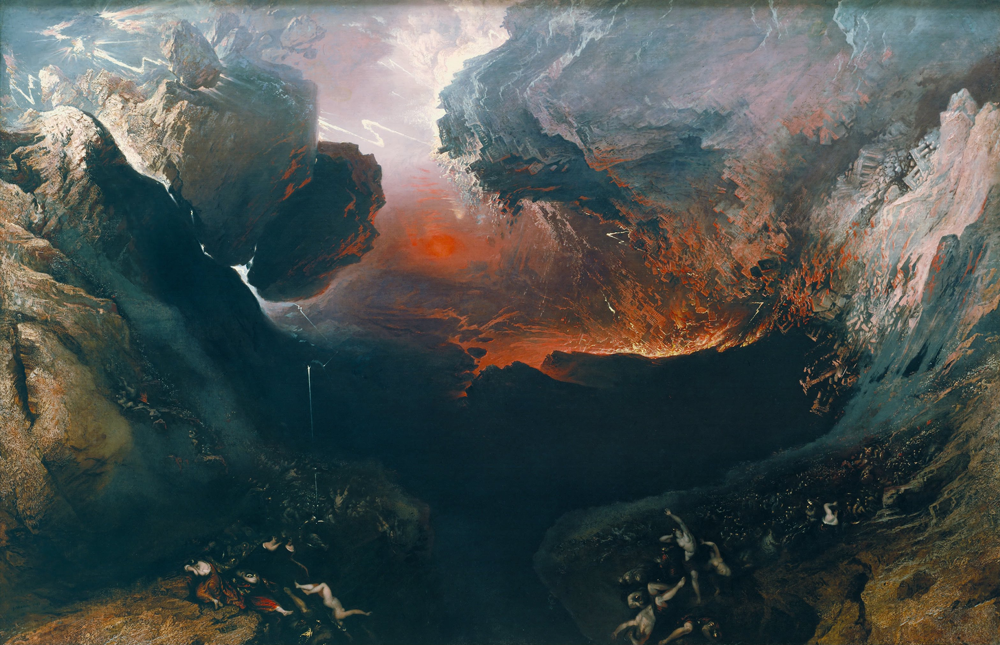
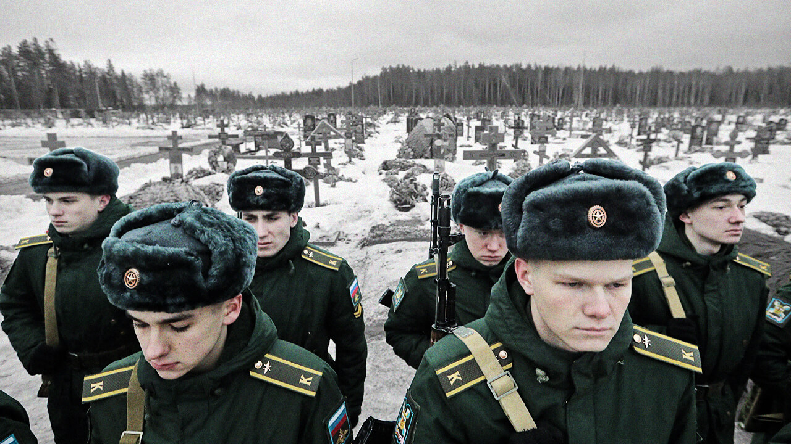

#

## 2023.06.13

### meme

An **Internet meme**, commonly known simply as a **meme** (*/miːm/, MEEM*), is a cultural item (such as an idea, behaviour, or style) that is spread via the Internet, often through social media platforms.**Memes** are considered an important part of Internet culture. They appear in a range of contexts (such as marketing, finance, politics, social movements, religion, and healthcare), and use of media from various sources can sometimes lead to issues with copyright.

1. institute 研究所
2. mutant 突变体，变种人
3. dental 牙科，牙齿的
4. fuse 保险丝，引信；融合，合成
5. emerge 出现，产生

### 2023.06.14

1. **plead** 辩护，求情

Donald Trump has **pleaded** not guilty to historic charges of mishandling sensitive files at a federal court in Miami, Florida.

唐纳德特朗普在佛罗里达州迈阿密的联邦法院对不当处理敏感文件的历史性指控表示不认罪。

2. **prosecution** 起诉，检查官，经营 / ˌprɑːsɪˈkjuːʃ(ə)n /

3. **indictment** 起诉书 / ɪnˈdaɪtmənt /

On the opposite side of the room sat the entire **prosecution** team, including special counsel Jack Smith, who announced the **indictment** last week.

在房间的另一边坐着整个检察团队，包括上周宣布起诉的特别检察官杰克·史密斯。

4. **attorney** 律师，代理人 / əˈtɜːrni /

有一个简单的方法来记住两者的区别。

- Lawyer 是学过法律并有相关的实务知识，但不一定通过加州律师考试或获得执业执照的人。即使一个律师可能完全了解法律体系，如果他们没有执照，他们也不能在法庭上代表你。
- Attorney 律师成功地通过了律师资格考试，达到了要求的道德品质资格，并获得了执业律师的执照，可以出现在法庭上为你辩护。

每个Attorney都可以成为Lawyer，但不是每个Lawyer 都可以成为Attorney

### 2023.06.16

1. **recruit** 招募；新兵 

   A tale of two **recruits**. 

   Sgt Nikita Loburets, **a squad leader** in Russian special forces, died on 20 May last year in a village in eastern Ukraine. He was 21.

   去年 5 月 20 日，俄罗斯特种部队的**一名班长** Nikita Loburets 中士在乌克兰东部的一个村庄去世。他 21 岁。

   **According to an account** by his father. 

   根据他父亲的说法

2. **disposable** 一次性的，一次性用品

   / dɪˈspoʊzəb(ə)l /

   Zzzz and people like him are being used almost as “**disposable troops**”

   祖zzz和他这样的人几乎被用作“一次性部队”

3. **private** 二等兵

   Saving Private Ryan 拯救大兵瑞恩

   Privates and non-commissioned ranks 二等兵和士官

4. **deliberately** 故意，有意，存心

   Russia is **deliberately** protecting its remaining professionals

   俄罗斯有意保护其剩余的专业人员

5. **veteran** 退伍军人，老兵；经验丰富，老练

   These losses have forced **veterans** out of retirement

   这些损失迫使退伍军人退出退休生活

### 2023.06.20

1.**alleged** （尤指无证据地）断言，声称

"Alleged" 是一个形容词，用于表示某件事或某人被指称或声称但尚未被证实或确认。

Trump responds to **alleged** recording of him showing off 'secret' government information.

2.**so-called** 所谓的

"所谓的" 可以翻译为 "so-called"。它常用于引述或形容某人或某事物被称为某个特定的名称或属性，但可能存在怀疑、不确定或讽刺的语气

3.**high-stakes**  

"High-stakes" 是一个常用的英语表达，用来描述重大风险或高度重要的情况。

U.S. Secretary of State Antony Blinken met with Chinese President Xi Jinping in Beijing on Monday, **concluding** a **high-stakes** visit.

ChatGPT翻译：美国国务卿安东尼·布林肯周一在北京与中国国家主席习近平举行会晤，结束了一次**高风险**的访问。

"High-stakes" 这个词组通常用于描述某种情境或事件具有重大风险、高度关键或重要性。在这个句子中，使用 "high-stakes visit" 表示这次国务卿与国家主席的会晤具有重大的风险和重要性。这可能是因为两国之间存在复杂的政治、经济或外交问题，会晤的结果可能对双方关系、国际局势产生重大影响。

翻译成 "高风险" 有助于突出这次会晤的重要性和风险，强调了双方在会晤中所面临的潜在风险和挑战。这种翻译有助于传达会晤的紧迫性和复杂性，以及双方在达成共识或解决问题方面的压力和挑战。

### 2023.06.21

China is **yet** to respond to Mr Biden's comments.

中国尚未对拜登的言论做出回应。

### 2023.06.27

1.**suppress** （尤指用武力）镇压，压制

Putin says armed rebellion would have been **suppressed**

普京称武装叛乱将被镇压

2.**mutiny** 兵变；叛乱；暴动

Vladimir Putin says Wagner **mutiny** leaders will be '**brought to justice**'
CHINESE (SIMPLIFIED)
弗拉基米尔·普京表示瓦格纳叛变领导人将被“绳之以法”