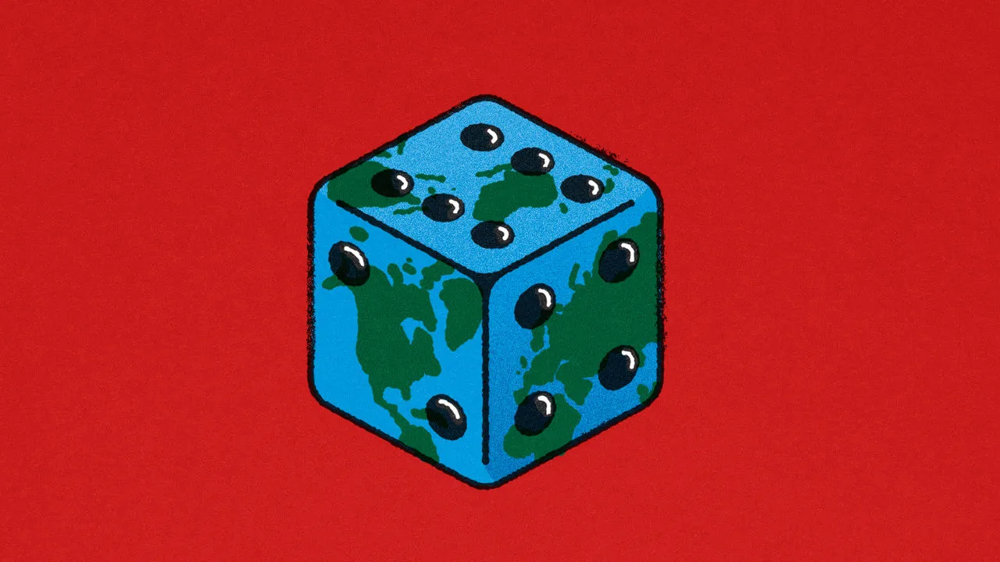

#### Why people struggle to understand climate risk

> The confusion inherent in a hotter world

Placed before you are two `urns`. Each contains 100 balls. You are given a clear description of the first urn’s contents, in which there are 50 red balls and 50 black balls. The economist running the experiment is `tight-lipped` about the second, saying only that there are 100 balls divided between red and black in some ratio. Then you are offered a choice. Pick a red ball from an urn and you will get a million dollars. Which urn would you like to pull from? Now try again, but select a black ball. Which urn this time?

Most people `plump for` the first urn both times, despite such a choice implying that there are both more and fewer red balls than in the second urn. This fact is known as the `Ellsberg paradox` after Daniel Ellsberg, a researcher at the `rand corporation`, a `think-tank`, better known for leaking documents detailing America’s involvement in the Vietnam war. Ellsberg, who died on June 16th, called the `behaviour ambiguity aversion`. It was a `deviation` from the model of `rational` choice developed by John von Neumann, a mathematician, and a demonstration that knowing the likelihood of something can `alter` decision-making.

The experiment may seem like just another of the `cutesy` puzzles beloved by economists. In fact, it reveals a deeper problem facing the world as it struggles with climate change. Not only are the probabilities of outcomes not known—the likelihood, say, of hurricanes in the Caribbean ten years from now—nor is the damage they might do. Ignorance of the future carries a cost today: ambiguity makes risks uninsurable, or at the very least prohibitively expensive. The less insurers know about risks, the more capital they need to protect their balance-sheets against possible losses.

#### 为什么人们难以理解气候风险

> 一个更加炎热的世界中存在的困惑

摆在你面前的是两个瓮。每个瓮中都装有100个球。你被清楚地告知了第一个瓮的内容，其中有50个红球和50个黑球。负责实验的经济学家对第二个瓮保持沉默，只是说其中的红球和黑球以某种比例分布。然后你被提供了一个选择。从一个瓮中取出一个红球，你将得到一百万美元。你想从哪个瓮中取球？现在再试一次，选择一个黑球。这次你会选择哪个瓮？

大多数人两次都选择了第一个瓮，尽管这样的选择意味着第一个瓮中既有更多的红球，也有更少的红球。这个事实被称为埃尔斯伯格悖论，以丹尼尔·埃尔斯伯格（Daniel Ellsberg）的名字命名，他是兰德公司的研究员，这是一个著名的智囊团，以泄漏详细描述美国参与越南战争的文件而闻名。埃尔斯伯格于6月16日去世，他称这种行为为"模糊规避"。这是对由数学家约翰·冯·诺伊曼（John von Neumann）发展的理性选择模型的偏离，也证明了了解某事的可能性可以改变决策。

这个实验可能看起来只是经济学家喜欢的另一个可爱的谜题。实际上，它揭示了世界在应对气候变化时面临的更深层次问题。我们不仅不知道结果的概率，比如说未来十年加勒比地区的飓风可能性，而且也不清楚它们可能造成的破坏。对未来的无知在今天带来了一种代价：不确定性使得风险无法获得保险，或者至少变得成本过高。保险公司对风险了解得越少，就越需要资本来保护它们的资产负债表免受可能的损失。

#### Ellsberg paradox

In decision theory, the Ellsberg paradox (or Ellsberg's paradox) is a paradox in which people's decisions are inconsistent with subjective expected utility theory. Daniel Ellsberg popularized the paradox in his 1961 paper, "Risk, Ambiguity, and the Savage Axioms". John Maynard Keynes published a version of the paradox in 1921. It is generally taken to be evidence of ambiguity aversion, in which a person tends to prefer choices with quantifiable risks over those with unknown, incalculable risks.

Ellsberg's findings indicate that choices with an underlying level of risk are favored in instances where the likelihood of risk is clear, rather than instances in which the likelihood of risk is unknown. A decision-maker will overwhelmingly favor a choice with a transparent likelihood of risk, even in instances where the unknown alternative will likely produce greater utility. When offered choices with varying risk, people prefer choices with calculable risk, even when they have less utility. 

Experimental research： Ellsberg's experimental research involved two separate thought experiments: the 2-urn 2-color scenario and the 1 urn 3-color scenario.

#### 艾尔斯伯格悖论

**艾尔斯伯格悖论**（英语：Ellsberg paradox）是决策论中的一个悖论，1961年由学者丹尼尔·艾尔斯伯格提出，以证明预期效用理论存在逻辑不一致的问题。

实验结论即艾尔斯伯格悖论，它表明人是模糊厌恶（Ambiguity averse）的，即，不喜欢他们对某一博弈的概率分布不清楚，也即，人在冒险时喜欢用已知的概率作根据，而非未知的概率。人在决策是否参赌一个不确定事件的时候，除了事件的概率之外，也考虑到它的来源。

