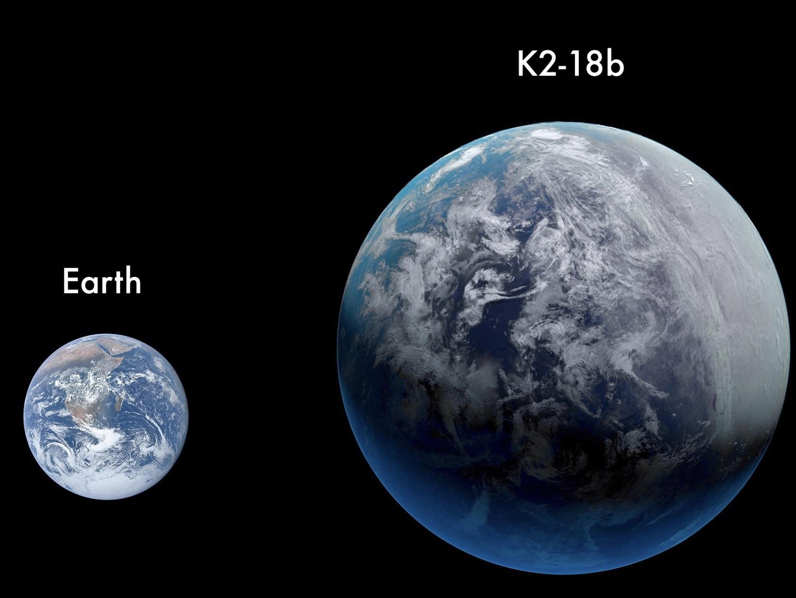

#

自由泳进行时。

最近还是开始了自由泳的练习，虽然之前尝试过，都也没能坚持住，一是游泳场地二是身体懒惰，又到了夏季，又赶上这个节点，果断试了几家离家近的游泳馆，最后定了省体中心，距离、停车、水质、场馆、价格都挺合适，办了年卡，准备长期去游了。

水，能快速的让我平静下来，我似乎喜欢一切和水有关的事物，雨、雪、冰、小溪、江河、大海。我喜欢下雨天看雨，看着雨滴落下，心里无比舒适。我喜欢看海，大海的平静汹涌我都喜欢，那是一种无限的包容，大海让我感到力量也然我感到平静。我也喜欢冰川，那种坚硬那种历史沉淀的厚重，还有冷，漠河的那种冷，呼吸成冰，到处都是水的形态，那冰天雪地里的杉树，笔直挺拔，就那样接受着寒冷，我抬头看的时候总是心生敬佩。

回到游泳，就回到了我欢乐的童年，那些美好的记忆，永远也不会消失，永远滋养着我的内心。只要一放假，我肯定是离开城市回到农村奶奶家，我喜欢农村，喜欢那里的一切，我喜欢和奶奶在一起，奶奶的爱是无条件的，她是会宠爱我的，做我想吃的，随便出去玩只要按点回来吃饭就行， 即使玩过头了，回来也会有留好的饭菜，一点埋怨都没有。我喜欢跟着奶奶下地，虽然不让我干活，但是就单单去到地里就很开心，一大杯茶叶茶，一顶遮阳帽，现在想想那茶是真解渴，累了坐在树荫下休息，那阴凉是真惬意，下地回来必须要到池塘里有个泳的。

我已不记得具体几岁开始下水，老家并不是一个多水的地方，但是从山上延续下来的村庄，在半山腰的位置出现了两个池塘，每到夏季雨水充沛起来，两个不大的池塘迅速蓄满了水，这些水都是从山上流下来，可以说是包罗万象，但是在我们孩子眼里这就是水，是快乐的源泉。水是浑浊的，根本看不见水下的一切，比较适合的一个池塘叫坝子坑，有浅水区也有深水区，浅水区供不会游泳孩子嬉水，深水区有大概3米的深度，加上水塘旁边就是一个农场，高出水面5米左右，场的边缘就成了跳台，供那些水性好又有胆量的孩子跳水表演的，那也是我一直羡慕的，但从来没敢跳过。我开始从浅水区摸索，不记得学过游泳，就在水里玩，开始的时候抱个塑料桶，就那么不知不觉就学会了游泳，当然只是不沉底的那种。

那时候，我只要下水，基本就会错过饭点，有时太饿了，就回家匆忙吃上两口，接着回到水里，那可是露天的池塘，又是大中午的太阳，可想而知我的皮肤会是多么的健康，黑的那叫一个亮堂，只不过这丝毫不会影响我们泡在水里。水性好的孩子啊在水里那真是潇洒，一个猛子扎到水底，捞出一把黄泥啪的一下糊别人脸上，又一个猛子消失在水中，被糊了一脸黄泥的孩子还不知道发生了什么。那时候我就特别羡慕那些水性好的孩子，心说什么时候能像他们一样驾驭这一塘黄水。

回到城市，真的快乐就只剩那么小小的一点，具体也不怎么记得是哪些了，好像是打游戏或者一些玩具，总之是一些回想起来并不能心里美滋滋的。城市里想游泳，不敢下河，也只能去游泳馆，县城不大，却有着一个标准泳池，浅水区1.2-1.8，深水区5米，有高低跳台可以跳水，省体的泳池也没有家里那个好。当然，泳池里的快乐是远远比不过坑里的，坑里的欢腾，嬉笑打闹，才是玩水的快乐所在。到了游泳馆就得把精力放在泳姿上了，开始学习游泳，把原来的狗刨式泳姿改成蛙泳。划手换气蹬腿，好像水的欢乐少了很多。后来，再回到老家，看着自己孩童时快乐的水塘，心里也在想，当时就是这个水塘给我的快乐吗。这么脏的水，这么小的地方，可那里确实是我童年最快乐地方。

现在我又被水召唤了，再次来到水里，是为了那难得的平静，进入水池的那一霎那，整个世界都安静了，身体好像轻了好多，思维迅速从兴奋转为逸散，那种感觉很美妙。我不再想从水里获得什么快乐，只想有这种亲密的接触，只想在水里获得一些平静，顺便能锻炼一下身体就是更好的了。现在我练习的泳姿是自由泳，但名字我就喜欢，自由的游泳。但是练习起来就是没那么如意，看了教程也自己做了练习，但是完全找不到感觉，与水的接触还是少，待我继续。

