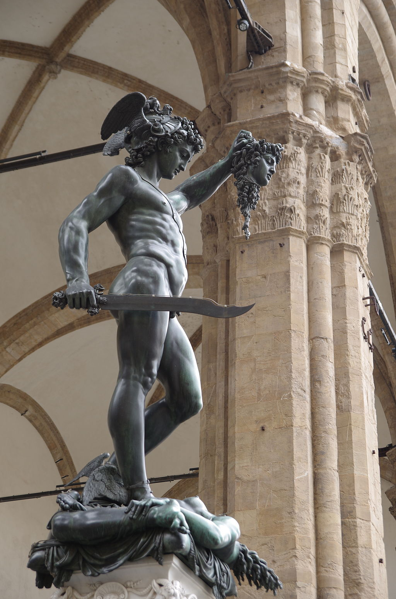
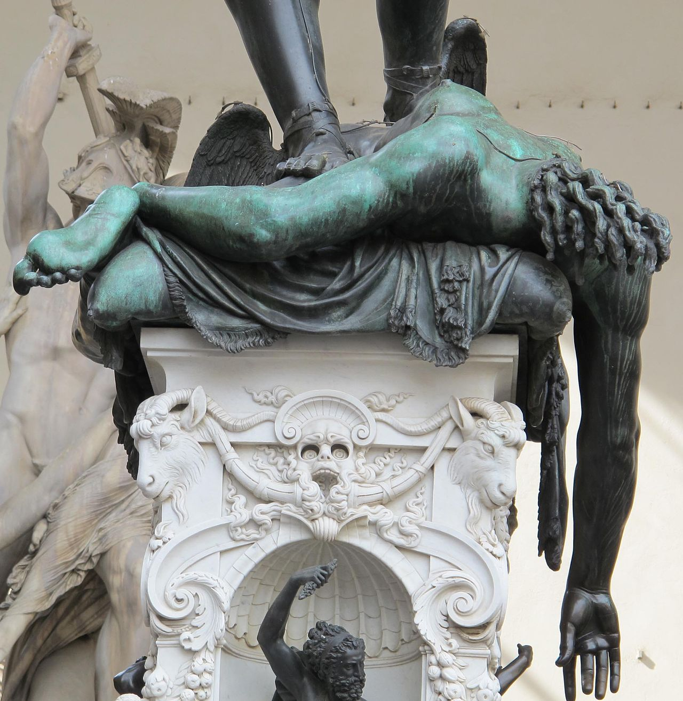
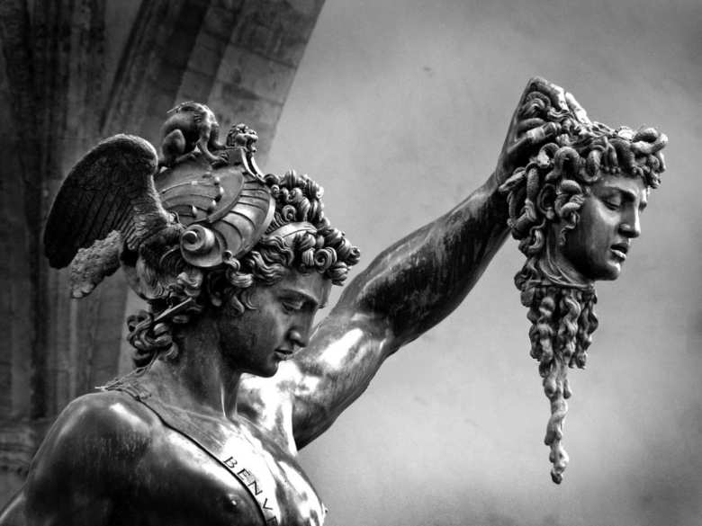

#

Perseus with the Head of Medusa is a well-known mythological image and story from ancient Greek mythology. Perseus was a hero in Greek mythology and the son of Zeus and Danae. The story goes that Perseus was sent on a quest to slay the Gorgon Medusa, a monstrous creature with snakes for hair whose gaze could turn people to stone.

With the help of the gods Athena and Hermes, Perseus was given various tools and gifts to aid him in his quest. He was given a mirrored shield to see Medusa's reflection without directly looking at her, winged sandals to fly swiftly, and a magical sword to behead her.

Using these gifts, Perseus managed to find Medusa's lair and behead her while avoiding her gaze. As soon as he severed her head, the winged horse Pegasus and the giant Chrysaor sprang forth from her body. Perseus swiftly collected Medusa's head, which still retained its petrifying power, and placed it in a magical sack for safekeeping.

The image "Perseus with the Head of Medusa" is often depicted in art and sculptures. It typically shows Perseus holding Medusa's severed head in one hand and his sword in the other. The image symbolizes the triumph of good over evil, as Perseus successfully completed his heroic task by slaying Medusa and using her head as a weapon.

This mythological story and its imagery have captivated artists and storytellers throughout history, inspiring numerous works of art and literature. It serves as a prominent example of Greek mythology's enduring influence on Western culture.

"带着美杜莎的头的珀尔修斯"是一个来自古希腊神话的著名形象和故事。珀尔修斯是希腊神话中的英雄，是宙斯和达娜伊的儿子。故事讲述珀尔修斯被派遣去击败蛇发女妖美杜莎，她的凝视能将人们石化。

在众神雅典娜和赫尔墨斯的帮助下，珀尔修斯得到了各种工具和礼物来协助他的任务。他获得了一面有镜子的盾牌，以便能看到美杜莎的反射而不直接注视她，还有有翅膀的凉鞋以快速飞行，和一把神奇的剑来斩首她。

利用这些礼物，珀尔修斯成功找到了美杜莎的巢穴，并在避开她的凝视的情况下将她斩首。在他砍下头颅的瞬间，翼马飞马和巨人克里剑索尔从她的身体中冲出。珀尔修斯迅速收集了美杜莎的头颅，头颅仍然保留着它的石化能力，并将其放入一个神奇的袋子中保存起来。

"带着美杜莎的头的珀尔修斯"的形象经常在艺术和雕塑中被描绘。通常情况下，图像显示珀尔修斯一手拿着美杜莎的被斩首的头颅，另一手持剑。这个形象象征着善恶之间的胜利，珀尔修斯成功完成了他的英雄任务，通过杀死美杜莎并使用她的头颅作为武器。

这个神话故事及其形象一直以来吸引着艺术家和故事讲述者，激发了许多艺术作品和文学作品的创作。它是希腊神话对西方文化持久影响的重要例证。