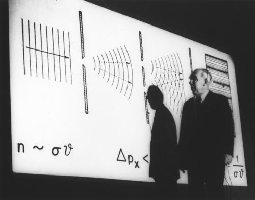

#

自我保护，永不过分。

我们用三年的时间学会说话，却用一生的时间学会闭嘴。

刚刚的一次经历又让我觉着自我保护永不过分，一时的善良或者叫替他人着想，反过来成了别人口中的说辞。兴师问罪的态度，似乎抓到了你多大的把柄，被质问时的不爽，也多是无可奈何。不管怎样，这件事再次印证，少说话！能不说就别说，不知道怎么说就别说，说了不知道好不好就别说，说了为了显摆自己就别说，能少说一句就少说一句，千万不要多说，不要为了你以为的善良，或者你以为的为他人着想，就多说一些话，别人自己理解之后，可以理解正确也可以理解不正确，可以自己听着，也可以给别人说，爱怎么说怎么说。所以为了避免这样的事情，就把嘴巴闭紧点，再紧一点，不多说一句。

第二个感受就是呵呵。如果没有那一幕所谓的下去帮我，可能我都不会想这件事，在下面说了这么久，已经把事情解决了，再回头说一些要去帮我的话，就让人感觉很呵呵了。昨天的情绪反应是真实的反应，心率上升，声音变大，体态动作开始不自然，这些都是以后需要注意的地方。面对任何情形，面对任何人，争取做到内紧外松，争取最大的平和，这样既不会影响情绪也不会因为情绪影响思路，以至于影响最后的行为。

第三个感受就是这件事对我的反应超出了我的预期，我以为我不会这么激动，可现实是我面对当事人来找事的时候很激动，至少生理上的反应超过了我自认为该有的限度。我以为这事我不会很在意，可是事情再脑子里反复推演，一直从昨天持续到了今天此时此刻，以至于我想写点东西梳理一下。这件事的发生其实很正常，但是整个事处理下来，我还是坚守了我的原则，第一不违法，第二不缺德。但是那种虚伪的东西还是让我感觉很不爽。

有时候我还是会在意一些人，一些根本不该动用我精力的人，但是这些人却实打实的在我脑子转，可能转几下，也可能转一会，但是只要出现就会影响到我的情绪，这种感觉很不喜欢。为什么要去想这些无关紧要的人呢，我事后能分析出的原因就是，这些人一般就是我之前认为挺好的人，结果却证明我高看了对方，这样的人会对我有影响，而且会激起我心底的厌烦，我对不喜欢的人基本是忽视，因为对待这些人多想一下都是对我精力的不尊重。可是那些我判断错的人，我为什么在意，或许是因为他们伪装的好，这种虚伪让我甚是反感，或者是我为我自己的错误看错了人，我是对自己在意而已。好像就是我以为你那么好，结果你是这种人，亏我用真心对你，我真是瞎了眼了，是这种感受让我在意？