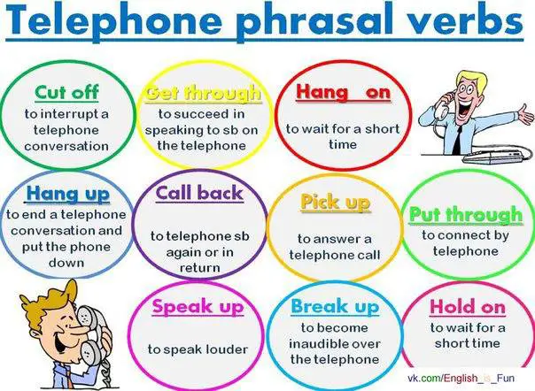
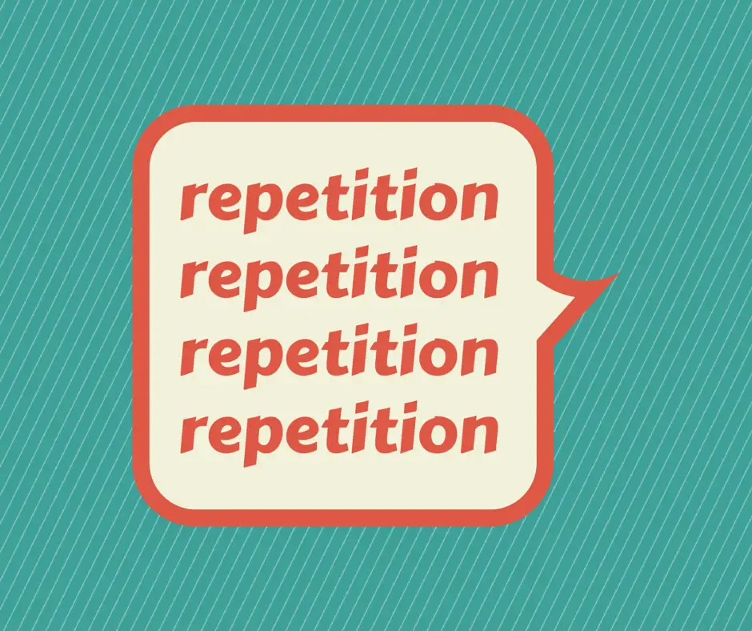

# 3 Steps to Stop Translating in Your Head and Start Thinking in English

*“When I speak English, I tend to translate words from my native language in my head and it takes me a lot of time just to speak a simple sentence.”*

Does this sound familiar to you?

If you want to speak English fluently and naturally, you need to stop translating in your head and learn to think in English.

**Why translating in your head is a BIG problem**

**Translation needs time.**

It takes you double time for processing information and looking for equivalent words or grammar structures to say in English.

That’s embarrassing sometimes.

Just imagine in a group discussion or business meeting for example, everybody takes turns to talk. And when it comes to your turn, you keep silent for a couple of minutes since you need time for translating from language to language.

People are not patient enough, you know.

Or even if they’re patient to wait for you, emergencies don’t wait.

How can you get your message across as quickly as possible in such urgent situations?

**Translation doesn’t successfully convey the messages.**

Languages are different.

There are words, slangs, and idioms in English that you can’t find any equivalent language unit in your mother tongue.

English grammar rules are unique as well. The order of words, structures, senses underlying each structure, etc. aren’t the same.

Even when you can find similar words or structures to translate, they may not transfer 100% the speaker’s message.

**Mistranslation is another issue.**

It happens when speakers don’t have good knowledge of English or their first language.

And really bad effects can be caused from mistranslation.

**For example, second language learners often mess up between “leave” and “abandon” although they mean totally different things in English.

Let’s talk about a very famous incident that you may know.

In 1977, when the president of the US traveled to Poland, he had a speech to the Polish in front of the media. His idea of “when I left the US, ...” was translated into “when I abandon the US, ...”.

The incident was then spread rapidly to both countries.

And you know the consequences, right?

The incident then became a funny story for media in both countries.

Now you see translation just makes things more and more complicated.

Steps to communicate the messages and time you need to process information are doubled. And you take risks when translating due to the translation errors.

**Learn to Think in English with these 3 Steps**

I’ll go through steps that train your brain to think in English.

Yes, I know that you think it’s difficult.

But actually, it may only be hard at the beginning. Once you get the right method, your worry will disappear.

You will soon find yourself thinking in English naturally.

**Step 1: Think in words**

Think small first. I mean think in words, only simple words.

Be patient. Don’t rush. You don’t need to.

Let’s make the learning process of a second language like your first one.

The learning of your mother tongue starts with simple words like mom, dad, grandpa, grandma, table, chair, dog, cat, pink, blue, and so on.

Just try doing this in English. You see things in your daily life, and you say them in English. Forget your mother tongue. Try to say everything you see in English, only English.

Later, in a conversation, the image or visualization of a real table will directly remind you of the word “table”.

Thinking and saying words in English connect the images and the words together. That helps you respond quickly when you speak.

So, you don’t need to recall the word in your first language and then again look for a similar word in English.

**Step 2: Think in sentences**

Now after the word level, move on to sentence level.

This step needs more time and effort. But it’s worth it.

Don’t worry. Start with simple and short sentences first like “it’s a table.”, “I have a table.”, “the table is blue.”, etc.

Just do it step by step and day by day. When you’re comfortable with four-word sentences, try longer sentences. Let’s say “my table is bigger than yours.”, “the table is next to the bookcase.”, “there is an apple on the table.”, etc.

The idea is to start with small pieces of language, and them make them bigger and bigger. Don’t jump to long and complicated sentences if you’re a beginner. Otherwise, you’ll be let down.

Now you’re much more familiar with the process, aren’t you?

**Step 3: Think in conversations**

Keep moving forward. Try to combine sentences into short talks.

**First, Make conversations with yourself**

As you’re not confident enough, start to talk with yourself first.

Some suggested topics may be your daily activities, family, friends, school, dream, favorites, and something similar.

It doesn’t matter how long it is, make sure that you can express a complete thought.

It’ll make more sense if the practice is done regularly on a daily basis.

While you’re doing housework, practice talking about activities during the day.

While you’re waiting at the airport, practice talking about how your flight might be.

While you’re outside for exercise, practice talking about what the weather is like today.

While you’re on the bus, practice talking about the traffic today, something like “Oh no, the traffic was terrible today. I got caught in a traffic jam. I had to wait hours in a long line of cars and buses. That was annoying.”

And so on.

Just make the best use of our time. Keep your mind busy with thoughts in English.

Take all the opportunities to think in English.

If you want to make it a habit, there’s no way except for practicing it on a daily basis.

Once your brain is successfully trained, you can speak automatically, naturally, and fluently.

**Finally, Make conversations with others**

Yes. It’s time to interact.

Interaction with others may be challenging at first, but it’s very useful for training your brain to think in English.

The final outcome is still the ability to come up with ideas and react to others in a short time. 

If you’re still not ready for real-life situations, practicing with a partner may help.

Making use of language expressions formed at the previous stage is recommended.

For example:

*Teacher: Mark, why are you so late?*

*You: Sorry, teacher. The traffic was terrible. I got caught in a traffic jam.*

You see?

Recycling is always good. You already prepared a range of expressions concerning different topics. And you can totally use them again and again. Just adjust a little bit to fit with the situations.

Be patient and follow the instructions step by step. Conversations will go as smoothly as you wish for sure.

**Some More Helpful Tips to Train Yourself to Think in English**

**Learn phrases for specific purposes/ situations**

****

You use different expressions for different purposes of communication. Classify expressions according to their functions to facilitate your thinking process.

Let’s say, for talking about likes, there is a variety of expressions.

I like/ love/ enjoy …

I’m interested in ...

I’m a big fan of …

I’m crazy about …

I’m mad about …

I’m keen on ...

That’s the method to help you think fast and speak natural English.

**Use English - English dictionary**

Using a bilingual dictionary just encourages translation.

Put that away. Start using an English - English dictionary.

Everything will be explained in English and English only.

You know why?

\- Bilingual dictionary interferes with the thinking in English process. It breaks the rules of “English only” and negatively changes the habit of thinking in English words, sentences that you’ve spent time practicing.

\- Monolingual dictionary gives you double practice. What you really need is the English input. You learn more vocabulary and grammar points reading English definitions. It’s also a strategy to train your skills of reading and processing information in English.

\- You get more information with a monolingual dictionary. Usually the synonyms, antonyms, pronunciation, and usages of words will be mentioned in an English - English dictionary; so you can get more knowledge of the words.

**Predict and imagine the situations in advance and when talking**

Prediction and visualization are really important. The purpose is for preparing the language in your head in advance.

Imagine what the situations will be like and prepare the language to be used.

Predict what the speaker is going to say and think ahead what you are going to say.

When the situations happen, just pick up the language you already prepared. That’s easy.

**Learn deeply**

Yay! This is the very last one.

Learning deeply means repetition and reinforcement.

The only way to do this is to learn one word or expression many times, repeat them over and over again.

Language learning is habit-based. If you learn something many times, links between neurons will be steadily strengthened. The process happens inside your brain.

Learning words, expressions, etc. deeply helps you speak English effortlessly without any hesitation.

In conclusion, learning to think in English is the best thing you can do if you want to speak English fluently, naturally and automatically. Try to apply these above 3 steps process and you will be surprised with your English fluency after a short period of time.