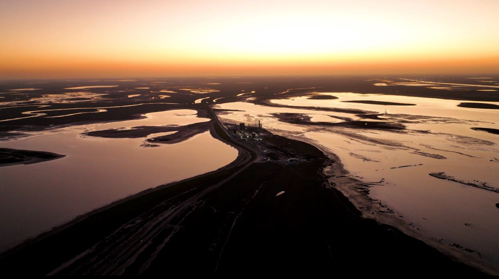
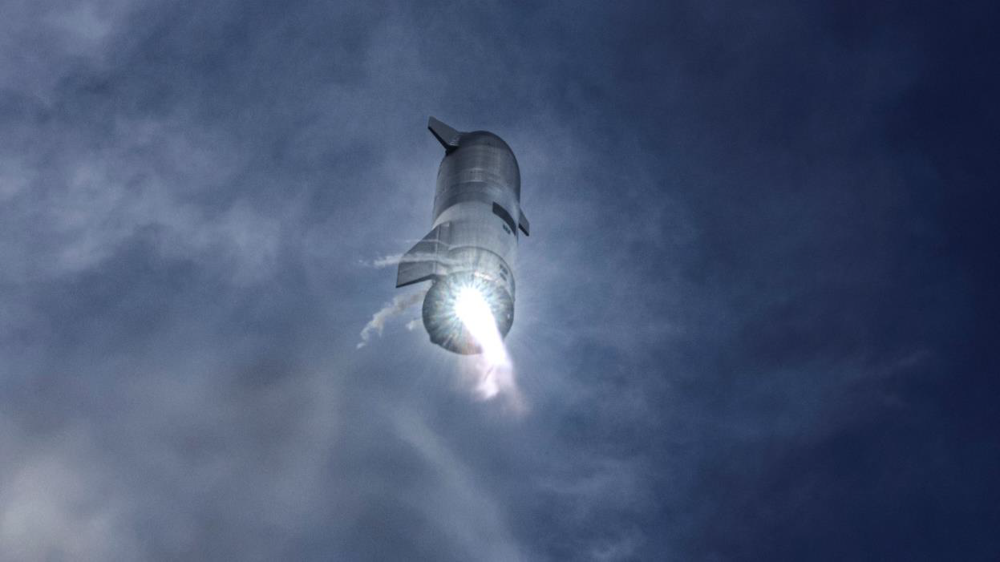
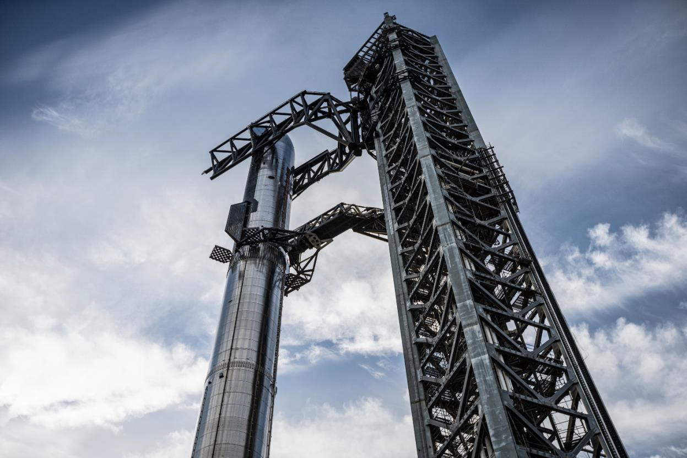

Development and manufacturing of Starship takes place at Starbase, one of the world’s first commercial spaceports designed for orbital missions. Located in Cameron County, Texas near the Gulf of Mexico, Starbase is one of four active launch sites in the United States operated by SpaceX. It is the first optimized for Starship, which can transport satellites, payloads, crew, and cargo to a variety of orbits and Earth, Lunar, or Martian landing sites. 

### Moving with Urgency Provides the Best Chance to Make Life Multiplanetary

Since 2020, SpaceX has performed multiple sub-orbital test flights of Starship from Starbase. These tests successfully demonstrated an unprecedented approach to controlled flight, during which the vehicle orients itself for a controlled aerodynamic descent, belly-first like a skydiver, accomplished by independent movement of two forward and two aft flaps on Starship, before lighting engines and flipping itself to a vertical configuration for landing.

Flying like this removes the need for wings and a tailplane, protects the vehicle from the extreme heat of orbital entry and minimizes the propellant needed for landing. It also enables missions to destinations across the Solar System where runways do not exist.

Flight data from all suborbital flights showed that less flap motion was required compared to predictions, which enabled the orbital version of Starship to have smaller and lighter flaps than those flown on the suborbital vehicle.

The Raptor relight and flip maneuver took several iterations, and in the process, the team made critical developments related to propellant management during the flip maneuver, plume interactions with the ground and with aerodynamic flow, and contingency logic. The final, successful landing of Starship was achieved despite the loss of one Raptor engine and the loss of pressure control in the fuel subtank. 

Overall, the suborbital campaign was critical in proving that Starship’s upper stage can fly through the subsonic phase of entry, where controllability and precision targeting of the vehicle is most challenging. Having achieved success in the suborbital campaign, the next big challenge for upper stage reusability is to survive the high-heating hypersonic phase of entry. Combined with in-space refilling, this will enable a fully reusable transportation system designed to carry both crew and cargo on long-duration, interplanetary flights and help humanity return to the Moon, and travel to Mars and beyond. 

### World’s Tallest Rocket Launch and Catch Tower

In 2021, SpaceX broke ground on the launch and catch tower at Starbase. The tower rises ~480 feet in height—the tallest launch tower in the world—and it is designed to support launch, vehicle integration, and catch of the Super Heavy rocket booster. Catching the booster reduces mass from the launch vehicle, moves hardware complexity to the ground, and enables rapid reuse of the rocket.

The tower's two giant robotic arms lift and stack Starship onto Super Heavy for final integration ahead of flight. Following liftoff, and after the two stages separate in-flight, Super Heavy will return to the launch site, reignite its engines to slow the vehicle down, and the tower’s arms will catch the rocket booster before re-stacking it on the orbital launch mount for its next flight. 

### Building a More Exciting Future

In tandem with ongoing Starship development and testing, the construction of a Starfactory is well underway at Starbase with the goal of producing and launching multiple Starships every week. Starbase directly employs more than 1,800 employees—making it the largest employer in the area—and economic activity generated by SpaceX supports thousands of more jobs in Cameron County and the larger Rio Grande Valley.

SpaceX is proud to be an active part of the local community. Starbase employees are involved with local events and regularly volunteer to help with beach cleanups, conduct community and education outreach, in addition to directly contributing to our mission to make a multi-planetary future a reality.

Go to spacex.com/careers to join the mission.

