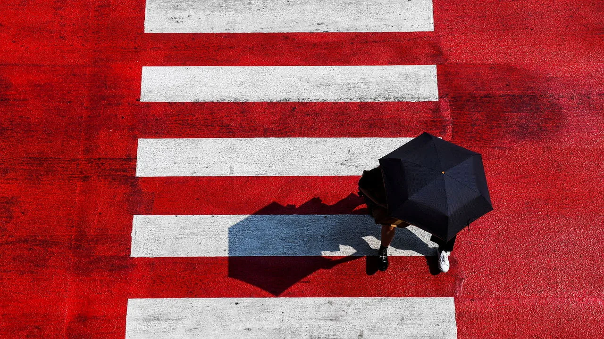

The Makers of Rules

Increasingly, I feel the truth behind this **statement**（说法）: the world is controlled by a **minority**（少数）. As I journey through life, I become more aware of the **insignificance**（渺小） of the individual, yet also of their importance. It is these significant individuals who **establish**（制定） the rules, and the majority of people live their lives governed by these rules. The masses seem to exist merely（仅仅） as a resource, akin（类似） to the management style of a North Korean dynasty. A whole country governed like a single family, where the **patriarch**（族长） holds absolute power over everything - from **appointing**（指定） personnel to **distributing**（分配） resources, holding the **authority**（权力） of life and death, showing no mercy, and **demanding unquestionable reverence**（唯我独尊）. Living under such a system, how can one claim to be truly free? Life becomes a cycle of **satisfying** basic needs, with the remaining time **dedicated** to working for the nation. In this context, people are nothing more than resources, used as the ruling **elite**（精英） sees fit. **Pondering further**（进一步思考）, we ourselves are not exempt from being resources, dedicating our lives to burn and heat under the rulers' rules.

The world's resources are limited, and these limitations **dictate**（决定了） that only a minority can fully enjoy them. The power to **allocate**（分配） these resources is the ultimate（终极） authority, as those who **possess**（拥有） the right to **distribute**（分配） resources not only benefit from them personally but also control others' **access**（使用权） to them. As I reflect on my life journey, it becomes evident that every aspect of life **is subject to**（受制于） certain rules. Our birth is not of our own choosing; we might not be born due to the presence of elder siblings. Education is not entirely our choice; we may miss out on schooling due to involvement in movements. Employment is not always within our control; even if we have a job, what we do is decided by the **higher-ups**（上级）. Our way of life is not **solely**（仅仅） determined by us; it is **dictated**（主宰） by societal standards. Success is not entirely in our hands, and even life and death are **beyond our control**.

Despite several generations' struggles and efforts, our **material wealth** has significantly improved, but our thinking remains largely unchanged. Instead of becoming increasingly **prosperous**（繁荣）, we seem to be growing spiritually poorer. Information is **exploding**, yet knowledge seems to be **declining**, and the common people are **drifting** further away from the truth. Most people lack the ability to **think independently**; they follow the crowd, easily **swayed**（摇摆） by popular opinions. This is **the state of** （状态）the **masses**（大众）, and it is because of this that a few individuals establish the rules, causing the vast majority to become **mere**（仅仅） resources, working for the nation. They receive what is called a salary while **dedicating**（奉献） their entire selves. In the end, their income largely returns to the hands of the state, seemingly provided with all material supplies, but at the cost of their **entirety**（全部）.

