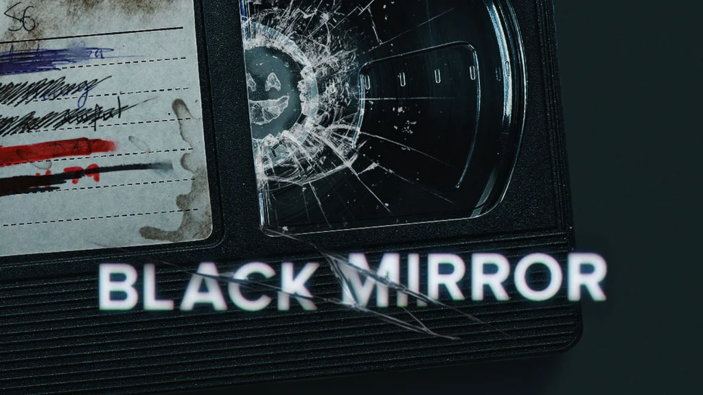

**Ventriloquism**（腹语术）, or ventriloquy, is a performance act of **stagecraft**（舞台艺术） in which a person (a ventriloquist) creates the illusion that their voice is coming from elsewhere, usually a puppeteered prop（傀儡道具） known as a "**dummy**". The act of ventriloquism is ventriloquizing, and the ability to do so is commonly called in English the ability to "throw" one's voice.

`In 2003, Dunham released Dear Walter..., a collection of questions asked of Dunham's fictional curmudgeon at live performances, authored by Dunham and Walter Cummings. His autobiography, All By My Selves: Walter, Peanut, Achmed and Me, was published by Dutton in 2010`

If you want to learn ventriloquism, or “vent,” you can find a few courses online, or on DVD. You can even find CD copies of Jimmy’s albums here and there. But the **mechanics** of learning to “throw your voice” are pretty simple. Anyone with a tongue, an upper **palate**,teeth, and a normal speaking voice can learn ventriloquism. 

This isn’t an instructional book, but I can give you the basics. The first thing to know is that a ventriloquist simply learns a different way of pronouncing words. Most sounds in the English language are produced without the use of lips, and are made inside the mouth and throat. Only a few sounds and letters **utilize** the lips. The only way a ventriloquist speaks differently is that he forgoes using his or her lips, and learns to reproduce sounds using the tongue, upper palate, and teeth only. Those “difficult”letters are B, F, M, P, V, W, and Y. Every other letter in the alphabet can be pronounced without moving your lips: A, C, D, E, G, H, I, J, K, L, N, O, Q, R, S,T, U, X, and Z. Go ahead! Try it! Put your teeth lightly together, part your lips slightly, hold them still, and pronounce that long list of easy letters. If you watch in a mirror, you’ll probably be **impressed** with yourself.

But now, try and pronounce the “difficult” letters without moving your lips. It can’t be done… unless you use the ventriloquist’s method: sound **substitution**.

Here is where I tip my hat to Jimmy Nelson and his record album Instant Ventriloquism. Recently Jimmy graciously granted me permission to share his method. This is the simplest way to learn vent:  For the difficult letters,you say one letter, but THINK another. So for B, use the letter D. The word boy becomes doy. You can say doy without moving your lips, but it doesn’t sound anything like boy. The trick is thinking the actual word and rehearsing. After you practice it over and over and over, the substitution sound starts to sound like the real sound, and eventually you will figure out for yourself how to make the sound as close to the real one as possible.

Here are a few more examples:

F becomes Eth

M becomes N

P is T

V is The

W is Duddle-oo

Y is Oh-eye

It all sounds **ridiculous** at first, but with many hours of practice, it can become very **convincing**. “Ny oh ny, tretty thunny stuth, don’t oo think?Holy noly! Ethen ny nother can tronounce oords like ne!”

