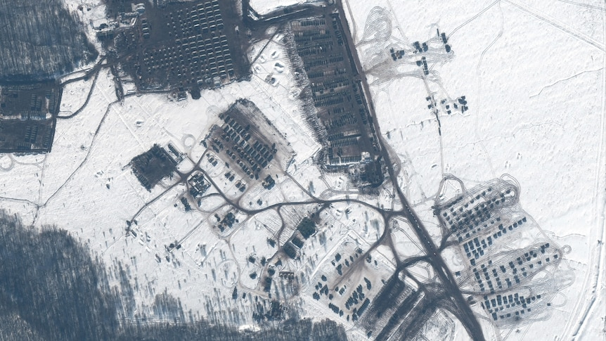

#

Lately, I have been watching some battlefield videos of the **Russo-Ukrainian war**. In the **winding** **trenches**, where killings occur at close range, I once again **lament** the cruelty of war. One by one, vibrant lives fall to the ground without experiencing pain or struggle, just **collapsing onto the earth**. The previous videos mostly **depicted** long-range attacks, where you don't witness a life disappearing so **vividly** before your eyes. You know there are **casualties** after an attack, but you don't know who they are, so the impact isn't as **profound**. Life becomes so cheap in war, **inevitably** leading one to **contemplate**: What exactly is war? Why does it start, and why does it persist?

Even now, I am not clear about the true purpose of the Russo-Ukrainian war. Perhaps even the soldiers who lost their lives on the battlefield are not clear either. All they can do is obey orders, to attack when commanded to attack and to defend when commanded to defend. Sometimes, watching those soldiers in the videos, one truly feels their helplessness. And those soldiers who **resort to suicide**, how deeply lost must they have been? Can they know why they went to the battlefield? Can they know what they are fighting for?

### Vocabulary

1.**winding** 曲折，弯曲，蜿蜒

2.**trench** 壕沟，沟渠；海沟，海底沟；战壕，堑壕

3.**lament** / ləˈment /

n.挽歌，悼文；表达哀伤（或痛惜）之情的言辞；抱怨
v.对……感到悲痛，对……表示失望；抱怨

4.**depict** 描述，描绘

5.**vividly** 生动的，强烈的

6.**casualty** / ˈkæʒuəlti /

伤亡人员；受害者，毁坏物；急诊室，急救室；事故，灾难（主要用于保险中）

7.**profound** / prəˈfaʊnd /

（影响）深刻的，极大的；（感情）强烈的，深切的；（思想）深邃的，（见解）深刻的

In summary, "significant" emphasizes importance and attention, while "profound" emphasizes depth, intensity, and lasting impact on one's emotions or understanding.

8.**inevitably** 不可避免地，必然地；意料之中

9.**contemplate** / ˈkɑːntəmpleɪt /

沉思，深思熟虑；盘算，打算；凝视，注视；考虑接受（发生某事的可能性）

10.**resort to suicide** 诉诸自杀

------

#### 战争谓之何

近来看了一些俄乌战争的战场视频，在曲折的战壕里零距离击杀，又一次感叹战争的残酷，一条条鲜活的生命应声倒地，感觉不到疼苦，感觉不到挣扎，就那么一头栽倒地面上。之前的视频基本都是远距离攻击的，不会那么真切的看着一条生命那么明显的消失在你面前，你知道攻击之后肯定有伤亡，但你不知道是谁，冲击并不大。生命在战争中是如此廉价，不禁让人思考，战争到底是什么，为何开始，又为何持续下去。

 到现在我并不清楚俄乌战争到底是为了什么，可能那些在战场上失去生命的战士也不清楚，他们能做的也只是服从命令，该进攻的时候进攻，该坚守的时候坚守。有时候看着那些视频里的战士真的非常无助，还有那些自杀的战士，内心得有多无助，他们能知道自己为什么上战场吗，能知道自己为何而战吗。