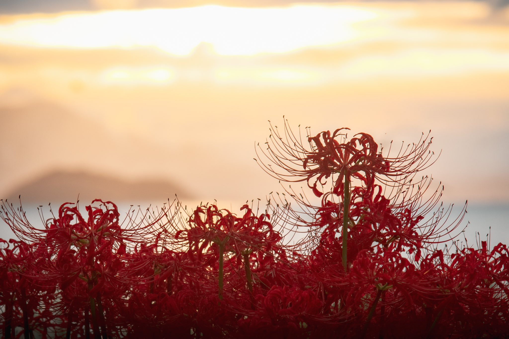

The sense of powerlessness in reality makes me start to doubt my educational beliefs.

 I can't escape, I can't run away. Everything will not **unfold**（展现） according to the life pattern（生活模式） I desire. I am simply living under the rules set by the ruling class. Should I still **pass on**（传递传给） the traditional educational models and beliefs to the next generation?

 The education I received emphasized hard work, **diligence**（勤勉）, honesty, and kindness to others, self-reliance rather than relying on connections, and **abiding by**（遵守） the law and **regulations**（法规）. It sounds very positive, but real life has mostly **overturned**（推翻） these principles. You don't need to work so hard or be so diligent. You can't always be honest or kind. As long as you have connections and support, the future belongs to you. In fact, history has always been this way; it didn't start today. It's just that it's clearer and more vivid now.

The only thing I can hold onto is the longing for and **persistence**（坚持） in freedom. The **constraints**（束缚） within the system should be the strongest. If you break free from the system and return to nature, you may find more freedom. I increasingly feel that freedom requires strong material support. Unless you can achieve it, you can abandon both your love and life for the sake of freedom. I can't do that, so my freedom needs material **backing**(后盾). Based on this, without material support, I can only have inner freedom, and this body can't escape.

If you ask me how to educate children now, my first reaction is a blank. I don't know how to guide him, or what kind of person to educate him to be, or what kind of person I hope he becomes. I have no **experience or lessons**（经验和教训） to share about my current life. It seems that such a life is neither high nor low, and stable living until retirement is already an **enviable**（羡慕的） life for many people. I even think that if my child could have such a stable job, it would be nice. How ironic and **absurd**（荒诞）.

 The freedom I long for may indeed be just a dream, a **distant shore**（遥远的彼岸） that can never be reached."

现实的无力感让我对自己的教育理念开始产生怀疑

 走不了，逃不掉。一切都不会按照自己想要的生活模式呈现，你只是生活在统治阶级制定的规则下，既往的教育模式和理念还要不要传给下一代。

 我受到的教育是，努力学习刻苦锻炼，待人诚实与人为善，依靠自己不靠关系，遵纪守法按章办事。听着就很正能量，可是现实的生活基本全部将这些推翻，你不用这么努力也不用这么刻苦，你不能诚实也不能善良，只要你有关系有靠山，未来就是你的。其实历史一直就是这样的，不是今天才开始，只是说现在看的更加真切和清晰。

 唯一能坚守内心的就是那份对自由的向往和执着。体制内的束缚应该是最强烈的，如果脱离体制回归自然，也许就自由很多。越来越真实的感觉到，自由是需要强大的物质支撑的，除非你能做到，若为自由故二者皆可抛。我做不到，所以我的自由需要物质做后盾，基于此，没有物质支撑，只能正确内心的自由，这副躯体是逃不出去的。

 现在如果问我如何教育孩子，我的第一反应是一片空白，我不知道该怎么引导他，或者教育他成为一个怎样的人，或者我渴望他变成一个怎样的人。对自己的目前的生活既没有经验而谈，也没有教训可说。似乎这样的生活高不成低不就，稳定的混吃等死，已经是很多人羡慕的生活了。甚至我也在想，如果我的孩子能有一份这样稳定的工作也是不错的，多么的讽刺和可笑。

 我所向往的那些自由，也许真的只是一种梦境，一个永远到达不了的彼岸。