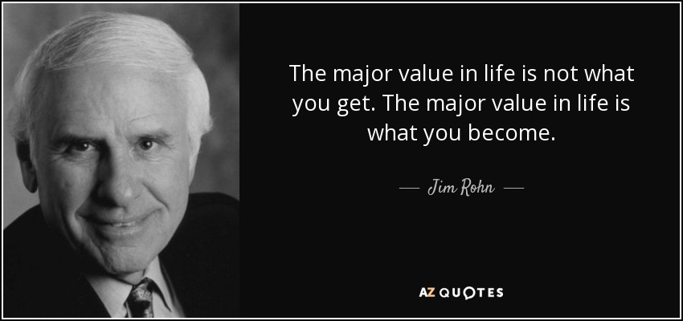

#

chatgpt：

A father was about to jump off a building because his son had committed suicide by jumping off the company building twenty days ago. He had been trying to negotiate compensation with the company but had not reached an agreement. Today, the father arrived at the third floor of the company's office building, holding a picture of his child, and sat by the window, preparing to jump. The police arrived at the scene as quickly as possible, and the rescue team and personnel from the family and relevant departments also arrived in time. The father, in his words, said he didn't want money, he wanted his child back, and he didn't let anyone come near. After repeated persuasion by the family members, they worked together to pull him away from the window to a safe position. Perhaps all of this was in order to expedite the negotiation of compensation, but how much is a life worth?

Regenerate response：

A father was about to jump off a building because his son had committed suicide by jumping from the company twenty days ago. They had been unable to reach an agreement with the company regarding compensation, and today the father came to the company's office building on the third floor with a portrait of his child, sitting by the window, ready to jump. The police arrived at the scene as quickly as possible, and the rescue team also arrived promptly, along with family members and personnel from relevant departments. The father, with tears in his eyes, kept saying, "I don't want money, I want my son back," refusing to let anyone come near. After repeated persuasion from the family members, they worked together to pull him away from the window and to a safe position. Perhaps all of this was in an effort to expedite the compensation negotiation, but how much is a life worth?

bing AI：

A father wants to jump off a building because his son committed suicide by jumping off the company building twenty days ago. He has been trying to coordinate compensation with the company but has not reached an agreement. Today, the father came to the third floor of the company office building with his child's portrait and sat by the window ready to jump off. The police arrived at the scene as quickly as possible, and the rescue team also arrived in time, as well as family members and personnel from relevant departments. The father said that he didn't want money but wanted people. He didn't let anyone approach him. After repeated persuasion from his family members, he was pulled from the window to a safe position. Perhaps all of this is for the sake of coordinating compensation as soon as possible, but how much is a life worth?
