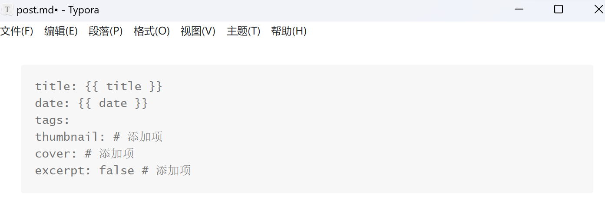

#

hexo new 新文章，文章页的front matter中只有titile，date，tags三项内容，一般情况下新建文章包含首页缩略图，文章页头图，不希望出现文章摘要信息。

通过修改根目录下scaffold文件夹下post.md文件，修改默认文章页front matter内容，添加所需要项目，如thumbnail文章首页缩略图，文章页头图cover，摘要excerpt不显示或者修改摘要内容。

PS：文章插入图片又出现hexo s本地无法显示的情况，昨天也是某种图片无法加载，具体原因不详，初步发现是图片名称格式或内容的问题，修改图片名称为相对简单的名称后，即可正常加载。如Screenshot 2023-06-06 094854.png无法加载，修改为Screenshot.png即可正常加载显示。

